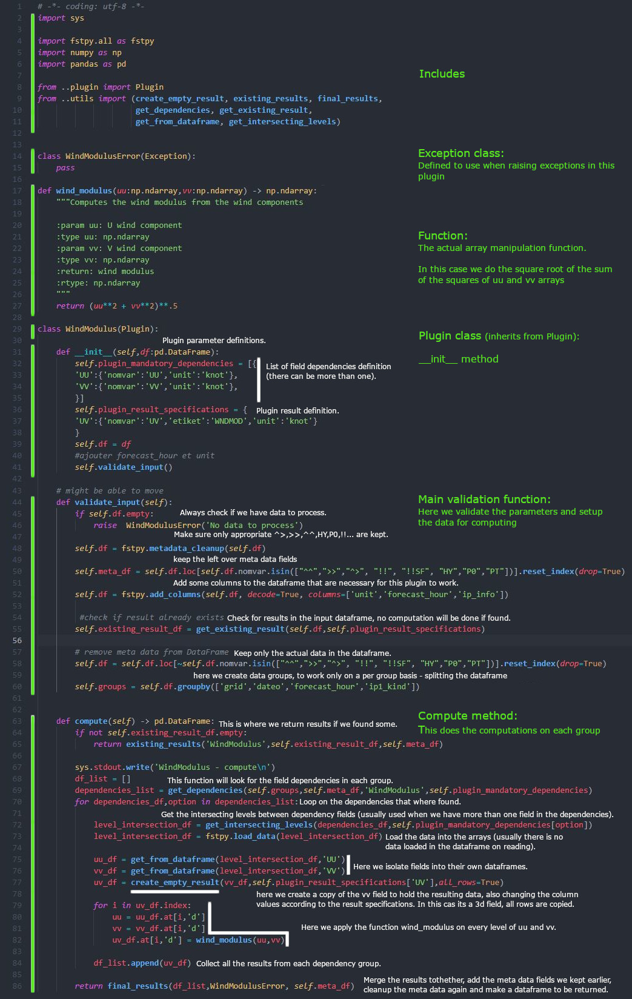

Anatomy of a simple plugin
==========================

.. note::
    See $project_root/templates for a physical example of the files

Creating the neccesary files and folders
----------------------------------------

.. code:: bash

    # in the $project_root/spookipy create folder with the name of your plugin
    cd spookipy
    mkdir example_plugin
    cd example_plugin

    # create a init files
    echo 'from .example_plugin import *' > __init__.py
    
    # create a base file to start from
    cp ../windmodulus/windmodulus.py example_plugin.py
    
    # replace WindModulus with ExamplePlugin
    perl -i -pe 's/WindModulus/ExamplePlugin/g' example_plugin.py
    
    # create a documentation file
    touch ExamplePlugin.rst

    cd ../..
    cd test
    # create a test file
    echo 'import pytest' >> example_plugin_test.py
    echo 'from test import TMP_PATH, TEST_PATH' >> example_plugin_test.py
    echo '' >> example_plugin_test.py
    echo 'pytestmark = [pytest.mark.regressions]' >> example_plugin_test.py
    echo '' >> example_plugin_test.py
    echo '@pytest.fixture' >> example_plugin_test.py
    echo 'def plugin_test_dir():' >> example_plugin_test.py
    # ExamplePlugin/testsFiles is a folder that should be created in ~spst900/ppp3TestFiles/ and ~spst900/ppp4TestFiles/
    echo '    return TEST_PATH +"ExamplePlugin/testsFiles/"' >> example_plugin_test.py
    echo '' >> example_plugin_test.py
    echo 'def test_1(plugin_test_dir):' >> example_plugin_test.py
    echo '    """Dummy test"""' >> example_plugin_test.py
    echo '    assert(True)' >> example_plugin_test.py

Text to copy in the __init__.py file
------------------------------------

::

    from .example_plugin import *
    
    
    
Text to copy in the test file
-----------------------------

::

    import pytest
    from test import TMP_PATH, TEST_PATH
    
    pytestmark = [pytest.mark.regressions]
    
    @pytest.fixture
    def plugin_test_dir():
    # ExamplePlugin/testsFiles is a folder that should be created in ~spst900/ppp3TestFiles/ and ~spst900/ppp4TestFiles/
        return TEST_PATH +"ExamplePlugin/testsFiles/"
    
    def test_1(input_file):
        """Dummy test"""
        assert(True)
    
    

Directory structure
-------------------

In $project_root/templates 
- You will find a sample with the correct directory structure

Foreign language support
------------------------

    **Fortran**

    In $project_root/spookipy/filterdigital
    - You will find an example of fortran code integration

    **C++**

    In $project_root/spookipy/windmodulus
    - You will find an example of c++ code integration

    
Description of the parts of the plugin
--------------------------------------

